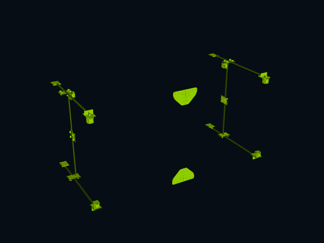

# CADCLAW

[](https://doi.org/10.5281/zenodo.19647391)

**The testing framework CAD never had.**



*Generated end-to-end with `make_disassembly_gif("M3-2_Assembly.step", "out.gif")` — 89 parts, 269 frames, no manual animation work.*

Automated validation, interference detection, and structural analysis for STEP assemblies. Like pytest for mechanical design.

## The Problem

CAD assemblies break silently. Parts clip into each other, BOMs drift from geometry, motor mounts end up 600mm from the motor. Engineers catch these errors by eye — if they catch them at all. There is no `pytest` for CAD.

## What CADCLAW Does

CADCLAW validates STEP assemblies through a chain of automated gates:

| Gate | What it catches |
|------|----------------|
| **Inventory** | Missing/extra parts. Labels by bbox signature, counts against expected. |
| **Interference** | Solid-solid overlaps. BRep boolean intersection, not just bbox. |
| **Adjacency** | Parts that should be near each other but aren't (motor 600mm from mount). |
| **Dimensional** | Wrong thickness, swapped `box()` args, impossible dimensions. |
| **Kinematics** | Beam deflection, motor torque budgets, belt tension, racking. |
| **Tolerance** | Worst-case, RSS, Monte Carlo tolerance stacking with Cpk and variance decomposition. |
| **Disassembly** | Sequenced part removal, radial exploded views, animation frame export. |
| **Render** | STEP → PNG → animated GIF via offscreen VTK. Closes the loop to shareable visuals. |

All gates run against a single loaded STEP file. The harness passes only if every gate passes.

CADCLAW also includes an **MCP Server** for Claude integration — all modules exposed as native tools.

## Quick Start

```bash
pip install cadquery
pip install CADCLAW   # or: git clone + pip install -e .
```

```python
from cadharness.harness import Harness
from cadharness.adjacency import AdjacencyRule

h = Harness("my_assembly.step")

h.add_inventory(
    labels={(40.0, 80.0, 1000.0): 'beam', (56.4, 56.4, 76.6): 'motor'},
    expected={'beam': 4, 'motor': 2, 'belt': 3}
)

h.add_interference(skip_labels={'belt', 'wheel'})

h.add_adjacency(rules=[
    AdjacencyRule('motor', 'bracket', max_distance=50)
])

report = h.run()
print(report)
# CAD HARNESS REPORT — PASSED
#   Parts: 42
#   Time:  3200ms
#
#   [PASS] inventory (120ms)
#   [PASS] interference (2800ms)
#   [PASS] adjacency (15ms)
```

## How It Works

Every solid in a STEP file has a bounding box. The sorted dimensions `(dx, dy, dz)` rounded to 0.1mm form a **signature** — a fingerprint that identifies part types without needing part names or metadata.

```
(40.0, 80.0, 1000.0) → "beam"     # 4080 C-beam extrusion
(56.4, 56.4, 76.6)   → "motor"    # NEMA23 stepper
(4.0, 80.0, 96.0)    → "mount"    # motor mount plate
```

This works because mechanical parts have characteristic dimensions. A NEMA23 is always 56.4mm square. A 4080 extrusion is always 40x80mm. The harness exploits this invariant to label, count, and validate without parsing STEP metadata.

## Origin Story

CADCLAW was extracted from the [M3-CRETE](https://github.com/sunnyday-technologies/M3-CRETE) open-source concrete 3D printer project, where it was developed during a human-AI collaboration between a mechanical engineer and Claude (Anthropic's AI). The harness:

- Caught 53 solid-solid interferences in a single run
- Reduced STEP file size from 70MB to 13MB by identifying geometry bloat
- Validated 150+ assembly changes across 15 design sessions without visual inspection
- Prevented 3 regressions that would have shipped broken geometry to builders

See [examples/m3_crete/](examples/m3_crete/) for the reference implementation.

## Modules

### `cadharness.inventory`
Label parts by bbox signature, count them, compare to expected inventory.

### `cadharness.interference`
Pairwise solid-solid overlap using OCC `BRepAlgoAPI_Common`. Bbox pre-filter for performance. Reports overlap volume in mm^3.

### `cadharness.adjacency`
Validate that parts of type A have a part of type B within N mm. Catches misplaced/scattered components.

### `cadharness.dimensional`
Check part dimensions against expected ranges. Catches wrong thickness, swapped args, scaling errors.

### `cadharness.kinematics`
Structural analysis from assembly parameters. Beam deflection (Euler-Bernoulli), motor torque budgets, belt tension, GT2 tooth skip resistance.

### `cadharness.tolerance`
Tolerance stack analysis: define dimension chains, compute worst-case / RSS / Monte Carlo accumulation, report Cpk process capability and per-dimension variance contribution. Identifies which dimension dominates the stack.

### `cadharness.disassembly`
Disassembly sequence generation: auto-orders parts by type priority and distance from centroid, computes radial explosion vectors, exports individual STEP frames for animation or a single exploded-view STEP.

### `cadharness.render`
Offscreen VTK rendering of STEP files to PNG, plus GIF stitching. `make_disassembly_gif(step, gif)` is one call — generates the disassembly frames, rasterizes them, and writes an animated GIF.

### `cadharness.harness`
The runner. Chains gates, loads parts once, reports pass/fail with timing.

### `cadclaw_mcp/`
MCP Server exposing all modules as Claude-callable tools. Connect to Claude Code or Claude Desktop — user describes what to check, Claude calls the tools. No code generation needed.

## CI/CD Integration

```yaml
# .github/workflows/cad-check.yml
- name: Validate assembly
  run: |
    pip install cadquery CADCLAW
    python check.py assembly.step
```

Exit code 0 = passed. Exit code 1 = failed. Works in any CI system.

## Who This Is For

- **Open-source hardware projects** — catch assembly errors before builders hit them
- **CadQuery/FreeCAD users** — the testing layer the ecosystem is missing
- **Small manufacturing teams** — automated QA between design and procurement
- **AI-assisted CAD workflows** — validate that AI-generated changes don't break the assembly

## Running Tests

```bash
git clone https://github.com/sunnyday-technologies/CADCLAW.git
cd CADCLAW
pip install cadquery

# Generate test fixture STEP assemblies (L1-L3, good + bad variants)
python tests/generate_fixtures.py

# Run the test suite (52 tests across every module)
python -m unittest tests.test_harness -v
```

The test fixtures are generated from CadQuery — no external downloads needed.
Three tiers of increasing complexity:

| Level | Parts | Tests |
|-------|-------|-------|
| L1: Bracket assembly | 5 | Inventory, interference |
| L2: Motor mount | 10 | Inventory, adjacency |
| L3: Gantry corner | 18 | Full 4-gate harness |

Each level has a "good" variant (should pass) and "bad" variant (deliberate errors
for the harness to catch: clipping, missing parts, scattered motors).

The suite also exercises tolerance stacking math against hand-calculated answers,
the full disassembly pipeline, the MCP server over real JSON-RPC, and end-to-end
GIF rendering.

## Requirements

- Python 3.10+
- CadQuery 2.7+ (provides OCC/STEP support)
- No commercial CAD software needed

## License

MIT License. Copyright (c) 2026 Sunnyday Technologies.

Built during the [M3-CRETE](https://m3-crete.com) project — an open-source concrete
3D printer where CADCLAW caught 53 interferences, reduced STEP file size from
70 MB to 13 MB, and validated 150+ assembly changes across a human-AI design collaboration.
