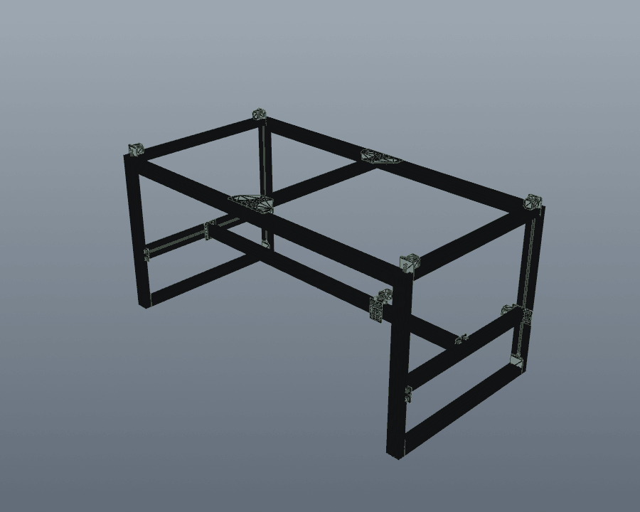

# CADCLAW

[](https://doi.org/10.5281/zenodo.19647390)

**Build STEP CAD assemblies from authored parts, then check them automatically.**



*Generated end-to-end with `render_radial_explode_gif("M3-2_Assembly.step", "out.gif")` — parts explode radially from the centroid, then camera orbits 360°. 99+ parts, no manual animation work.*

CADCLAW does two things. It **assembles**: a declarative spec places your authored STEP parts by connector frames and datum chains, compiles the assembly with CadQuery, and emits a design inventory, a model-derived BOM, review renders, and step-by-step build sequences. It **verifies**: automated gates (inventory, interference, adjacency, dimensional, orientation, floating-part, color/material, structural, tolerance stacking, parity) plus a **BOM-vs-CAD audit** and an **honesty toolchain** (doctor, publish-audit, claim-audit).

CADCLAW places parts you authored in real CAD. It does not generate geometry: no parametric plates, no bolt-circle helpers, no hole patterns. You draw the parts, CADCLAW seats them against each other and checks the result.

Like pytest for mechanical design, *in spirit*. Real CAD has analog characteristics pytest doesn't have (a part isn't binary present/absent, it can be slightly the wrong size, slightly clipping, slightly misplaced), so CADCLAW reports findings with severity, evidence, and a confidence budget rather than just pass/fail.

CADCLAW is also the open verification engine behind **[MARB](https://marb.cadclaw.io)** — the Mechanical Assembly Readiness Benchmark — whose graders import CADCLAW's gates to score how well AI assembles a complete machine in CAD. See the [MARB repository](https://github.com/sunnyday-technologies/MARB).

## The Problem

CAD assemblies break silently. Parts clip into each other, BOMs drift from geometry, motor mounts end up 600mm from the motor. Engineers catch these errors by eye — if they catch them at all. CADCLAW automates the geometric checks. It does **not** replace engineering judgment, structural certification, or physical-build validation.

## What CADCLAW Does

### 1. Assemble

An assembly spec (`assembly_spec.v0.1`) declares the parts, where they come from, and how they seat against each other. `cadclaw assemble` resolves that spec and compiles it into a STEP assembly with CadQuery.

| Command | What it does |
|---------|--------------|
| `assemble validate-spec` | Validate a spec before compiling. Unknown keys fail; incomplete work is declared explicitly as `not_built_yet`. |
| `assemble build` | Resolve authored STEP sources and compile the assembly. `--dry-run` resolves paths without touching geometry. |
| `assemble check-round` | Build, inventory-check, render review views, and report one assembly round. The main iteration loop. |
| `assemble inspect-component` | Inspect one authored STEP component: bbox signature, part count, isolated review renders. |
| `assemble render-views` | Render the `review_views` a spec declares (iso, hero, front, side, top, and more). |
| `assemble render-sequence` | Export partial assembly STEPs, per-step review views, a BOM CSV, and an optional rotating GIF. |

Parts are placed **by constraint, not by hand-typed coordinates**. An instance declares `place_relative_to`: seat *this* connector frame against *that* parent frame, offset along an axis. The resolver walks the datum chain in topological order and solves each transform, reporting cycles and missing frames as findings. Absolute transforms still work, so migration is incremental. `lock: axis` solves only the handoff axis for parts that span the other two, like a gantry.

Connector frames (extrusion ends, mount faces, rail slots, wheel contacts, shaft axes, belt planes) are recorded per component in connector metadata. This is descriptive data about parts you authored. It does not generate contextual geometry.

Assembly outputs are non-authoritative by design: `protected_paths` stops a build from overwriting your real CAD exports.

**Docs:** [The assembly spec](docs/assembly-spec.md) is the field-by-field reference. [`examples/relative_placement/`](examples/relative_placement/README.md) is a small runnable example of constraint placement: three parts, one datum, both lock modes, with the solved coordinates asserted in tests.

```bash
cadclaw assemble check-round examples/relative_placement/gantry.yaml
```

### 2. Verify

CADCLAW validates STEP assemblies + BOM JSON through a chain of automated gates:

| Gate | What it catches |
|------|----------------|
| **Inventory** | Missing/extra parts. Labels by bbox signature, counts against expected. Per-region (axis-aligned) constraints supported. |
| **Interference** | Solid-solid overlaps. BRep boolean intersection, not just bbox. |
| **Adjacency** | Parts that should be near each other but aren't (motor 600mm from mount). |
| **Dimensional** | Wrong thickness, swapped `box()` args, impossible dimensions. |
| **Orientation** | Rotated/mis-faced parts where a label declares an expected face plane. |
| **Floating** | Parts isolated from configured structural labels beyond a max gap. |
| **Color/material** | STEP AP242 color metadata against expected label colors. |
| **Structural** | Beam deflection, motor torque budget, belt tension. Static load math, not motion-clearance or full-travel sweeps. |
| **Tolerance** | Worst-case, RSS, Monte Carlo tolerance stacking with Cpk and variance decomposition. |
| **Parity** | STEP-vs-STEP comparison; flags hidden/suppressed-part export drift. |
| **BOM audit** | BOM JSON ↔ CAD assembly: qty, mfg_type, required/forbidden text terms, CAD-side count. |
| **Disassembly** | Sequenced part removal, radial exploded views, animation frame export. |
| **Render** | STEP → PNG → animated GIF via offscreen VTK. |

The CLI harness runs the checks declared in `cadclaw.yaml`; geometry checks share the STEP export when possible, while parity, render, disassembly, tolerance, and audits are also available as focused commands/APIs. Every report includes a **confidence budget** that lists what was checked, what was not, and what assumptions were made.

CADCLAW also includes a local **MCP Server** with 23 declared tools. The six `assemble_*` tools build and inspect assemblies; the remainder expose checks, analysis, audits, and rendering. It does not provide native-CAD application control, but it is **not a security sandbox**: path-taking tools can read specified files, assembly tools can write configured outputs, and the server inherits the local process account's filesystem permissions. Use a least-privilege working copy and review tool inputs and outputs.

The render-producing assembly tools return their PNGs as **inline images**, so the assistant can look at what it just built instead of trusting a path string. Every render is also written to disk, giving the human a per-step traceability artifact of what changed and when.

An approval-gated loop is: supply authored parts and a task, propose an assembly-spec edit, run `assemble check-round`, inspect the report and review renders, then have a qualified human decide whether to accept another iteration. A passing report means only that the configured gates passed.

## What CADCLAW Does NOT Prove

CADCLAW checks the geometry of a STEP file, the JSON of a BOM, and the text of your README against rules you write. It does **not** prove:

- That the **native CAD model** has no hidden or suppressed parts. CADCLAW reads the STEP export, which can silently drop invisible parts.
- That the **physical build** matches the CAD. CAD passing CADCLAW says nothing about whether the parts on your bench match the file.
- That a **vendor part is in stock**, available, or the price you assumed.
- That a **printed part is strong enough** for production use. CADCLAW's kinematics gates do bare-beam math; they don't simulate printed-PLA fatigue, layer adhesion, or thermal creep.
- That a **structural claim is physically certified**, unless you've attached measurement data with an evidence tag.
- That an **AI-generated CAD change is correct** without passing the gates. CADCLAW is the check; not passing it doesn't make a change correct, only "passed the gates we have."

Each report includes a **confidence budget** per gate: `checked`, `not_checked`, `assumptions`. Read it.

## Honesty toolchain

- `cadclaw doctor` — environment diagnostic. Run this first.
- `cadclaw publish-audit` — checks configured publication-boundary patterns before you commit; it is not a guarantee that every sensitive value is detected.
- `cadclaw claim-audit` — text linter that flags selected overclaim patterns and untagged numeric assertions in configured text surfaces.

These three tools exist because the truthfulness of CADCLAW's reports is only as good as the truthfulness of the docs and BOM that surround them.

## Using CADCLAW with an AI assistant

If an AI assistant is editing your CAD code, point it at [AGENTS.md](AGENTS.md). The short version: **place authored parts; do not generate them.** CADCLAW verifies geometry the user authored in native CAD tools; only genuinely parametric stock (extrusion bars, V-wheels) should ever be generated by the assistant. AGENTS.md exists because field tests showed that AI-generated plates and motor mounts can ship with hole patterns that do not align with their assemblies.

For diagnostic queries (signature histogram, "what is this part", "what overlaps with X"), use `cadclaw inspect` rather than writing throwaway probe scripts.

## Quick Start

```bash
pip install cadclaw
# cadquery, vtk, Pillow, pyyaml, pydantic are pulled in automatically.
# For editable dev installs:
#   git clone https://github.com/sunnyday-technologies/CADCLAW.git
#   cd CADCLAW && pip install -e .

cadclaw doctor                          # verify your environment first
```

### Programmatic API

```python
from cadclaw.harness import Harness
from cadclaw.adjacency import AdjacencyRule

h = Harness("my_assembly.step")

h.add_inventory(
    labels={(40.0, 80.0, 1000.0): 'beam', (56.4, 56.4, 76.6): 'motor'},
    expected={'beam': 4, 'motor': 2, 'belt': 3}
)

h.add_interference(skip_labels={'belt', 'wheel'})

h.add_adjacency(rules=[
    AdjacencyRule('motor', 'bracket', max_distance=50)
])

report = h.run()
print(report)
# CAD HARNESS REPORT — PASSED
#   Parts: 42
#   Time:  3200ms
#
#   [PASS] inventory (120ms)
#   [PASS] interference (2800ms)
#   [PASS] adjacency (15ms)
```

### CLI workflow

Configure once in `cadclaw.yaml` — labels, expected inventory, regions, BOM
rules, claim-audit terms, publish-audit globs — then drive everything from
the `cadclaw` console script:

```bash
cadclaw doctor                                    # 1. verify the environment
python examples/init_rules.py --step my.step      # 2. scaffold cadclaw.yaml
                              --bom bom.json
cadclaw harness --rules cadclaw.yaml              # 3. run configured YAML-backed checks
cadclaw bom-audit --rules cadclaw.yaml            # or run a single gate
cadclaw publish-audit --rules cadclaw.yaml        # before `git push`
cadclaw claim-audit --rules cadclaw.yaml --report-format md -o report.md
```

Exit codes: `0` pass, `1` fail, `2` warn-only (no fails), `3` internal error.

### BOM-vs-CAD audit (the v0.6 headline)

```yaml
# cadclaw.yaml fragment
bom_audit:
  bom_path: bom/data.json
  rules:
    - id: 5
      expected_qty: 12
      expected_label: connector_bar
      forbidden_terms: ["maximum rigidity", "primary stiffness"]
    - id: 65
      expected_qty: 3
      expected_unit: "bars (1.0m each)"
      expected_mfg_type: buy
      required_terms: ["1m", "friction-fit"]
      forbidden_terms: ["JB Weld", "West System", "custom 2m cut"]
```

The audit catches:

- BOM `qty` / `mfg_type` / `unit` mismatches
- Required-term-missing / forbidden-term-present in `name + description + notes`
- CAD-side count drift (CAD has 16 connectors, BOM expects 12)
- BOM items with no CAD geometry (suppressed for `mfg_type: consumable / electronic / fastener`)
- CAD parts with no covering BOM rule

Private BOM fields (`vendors`, `sku`, `unit_cost`, anything starting with `_`)
are dropped at the serializer level and never appear in any report.

## How It Works

Every solid in a STEP file has a bounding box. The sorted dimensions `(dx, dy, dz)` rounded to 0.1mm form a **signature** — a fingerprint that identifies part types without needing part names or metadata.

```
(40.0, 80.0, 1000.0) → "beam"     # 4080 C-beam extrusion
(56.4, 56.4, 76.6)   → "motor"    # NEMA23 stepper
(4.0, 80.0, 96.0)    → "mount"    # motor mount plate
```

This works because mechanical parts have characteristic dimensions. A NEMA23 is always 56.4mm square. A 4080 extrusion is always 40x80mm. The harness exploits this invariant to label, count, and validate without parsing STEP metadata.

## Author

CADCLAW is authored and maintained by [Sunnyday Technologies](https://sunn3d.com), led by Nicholas Sonnentag ([ORCID 0009-0002-1897-384X](https://orcid.org/0009-0002-1897-384X)). Development uses Sunnyday Technologies' LLM-assisted engineering practice; design decisions, engineering judgment, test fixtures, and direction are owned by the Sunnyday Technologies team.

Contact: `info@sunn3d.com`

## Citation

If you use CADCLAW in published research or derivative work, please cite:

```
Sonnentag, N. (2026). CADCLAW: Automated validation framework for
STEP-based CAD assemblies. Sunnyday Technologies.
https://github.com/sunnyday-technologies/CADCLAW
DOI: 10.5281/zenodo.19647390
```

A [`CITATION.cff`](CITATION.cff) file is included for automated citation tooling.

## Origin Story

CADCLAW was developed alongside the [M3-CRETE](https://github.com/sunnyday-technologies/M3-CRETE) open-source concrete 3D printer project to make checks over a large, part-dense authored assembly repeatable. Historical development observations motivated the inventory, interference, adjacency, dimensional, parity, and publication-boundary checks. Treat those observations as test-design inputs, not as proof of avoided fabrication costs, prevented defects, physical validation, or universal performance. The current repository tests and versioned reports are the controlling evidence for specific behavior.

See [examples/m3_crete/](examples/m3_crete/) for the reference implementation.

## Modules

### `cadclaw.assembly_spec`
The declarative contract a human or LLM edits before compilation. Strict pydantic schema: unknown keys fail validation, generated outputs cannot overwrite protected CAD exports, and incomplete work is represented explicitly as `not_built_yet`. Defines `Instance`, `Transform`, `RelativePlacement`, and `ReviewView`.

### `cadclaw.assembly_compiler`
Resolves a spec into geometry. `resolve_relative_placements()` walks the datum chain topologically and solves constraint-placed transforms; `run_assembly_build()` compiles the STEP; `run_assembly_check_round()` builds, checks, and renders one iteration; `run_assembly_sequence()` exports the step-by-step build. Also writes the design inventory and BOM CSV.

### `cadclaw.connector_metadata`
Local coordinate frames per authored component: extrusion ends, mount faces, rail slots, wheel contacts, shaft axes, belt planes. The bridge between an authored STEP asset and reliable constraint placement. Descriptive only; it does not author geometry.

### `cadclaw.component_manifest`
Observational index of an authored STEP library: where assets live, their bbox signatures, and which entries still lack BOM or connector metadata.

### `cadclaw.inventory`
Label parts by bbox signature, count them, compare to expected inventory.

### `cadclaw.interference`
Pairwise solid-solid overlap using OCC `BRepAlgoAPI_Common`. Bbox pre-filter for performance. Reports overlap volume in mm^3.

### `cadclaw.adjacency`
Validate that parts of type A have a part of type B within N mm. Catches misplaced/scattered components.

### `cadclaw.dimensional`
Check part dimensions against expected ranges. Catches wrong thickness, swapped args, scaling errors.

### `cadclaw.kinematics`
Structural load math from assembly parameters: beam deflection (Euler-Bernoulli), motor torque budget, and belt tension against breaking/working limits. Static analysis only; it does not sweep range of motion or check clearance through travel.

### `cadclaw.tolerance`
Tolerance stack analysis: define dimension chains, compute worst-case / RSS / Monte Carlo accumulation, report Cpk process capability and per-dimension variance contribution. Identifies which dimension dominates the stack.

### `cadclaw.disassembly`
Disassembly sequence generation: auto-orders parts by type priority and distance from centroid, computes radial explosion vectors, exports individual STEP frames for animation or a single exploded-view STEP.

### `cadclaw.render`
Offscreen VTK rendering of STEP files to PNG, plus GIF stitching. `make_disassembly_gif(step, gif)` is one call — generates the disassembly frames, rasterizes them, and writes an animated GIF.

### `cadclaw.harness`
The runner. Chains gates, loads parts once, reports pass/fail with timing.

### `cadclaw_mcp/`
Local MCP Server exposing 23 CADCLAW assembly, check, analysis, audit, and render tools to compatible hosts. The six `assemble_*` tools cover spec validation, compilation, the check round, component inspection, review rendering, and sequence export; the remainder run checks and audits. Render-producing tools return PNGs inline and can write configured output files. The server runs with the local process account's permissions and is not a security sandbox.

## CI/CD Integration

```yaml
# .github/workflows/cad-check.yml
- name: Validate assembly
  run: |
    pip install cadclaw
    python check.py assembly.step
```

Exit code 0 = passed. Exit code 1 = failed. Works in any CI system.

## Who This Is For

- **Open-source hardware projects** — evaluate configured assembly checks before release
- **CadQuery/FreeCAD users** — add repeatable checks over exported STEP assemblies
- **Small manufacturing teams** — support human QA between design and procurement
- **AI-assisted CAD workflows** — test proposed placement changes against declared gates

## Running Tests

```bash
git clone https://github.com/sunnyday-technologies/CADCLAW.git
cd CADCLAW
python -m venv .venv
.\.venv\Scripts\python -m pip install --upgrade pip
.\.venv\Scripts\python -m pip install -e .

# Generate test fixture STEP assemblies (L1-L3, good + bad variants)
.\.venv\Scripts\python tests/generate_fixtures.py

# Run the full test suite
.\.venv\Scripts\python -m unittest discover tests
```

The test fixtures are generated from CadQuery — no external downloads needed.
Three tiers of increasing complexity:

| Level | Parts | Tests |
|-------|-------|-------|
| L1: Bracket assembly | 5 | Inventory, interference |
| L2: Motor mount | 10 | Inventory, adjacency |
| L3: Gantry corner | 18 | Full 4-gate harness |

Each level has a "good" variant (should pass) and "bad" variant (deliberate errors
for the harness to catch: clipping, missing parts, scattered motors).

The suite also exercises tolerance stacking math against hand-calculated answers,
the full disassembly pipeline, the MCP server over real JSON-RPC, and end-to-end
GIF rendering.

## Requirements

- Python 3.10+; Python 3.11 is the current CADCLAW development runtime
- CadQuery 2.7+ (provides the OCCT/STEP layer; see [License](#license) for the third-party chain)
- VTK 9.3+ for rendering, plus Pillow 10+, pyyaml 6+, and pydantic 2.5+ (pulled in automatically)
- No commercial CAD software needed for CADCLAW's own checks. Validation that depends on the native CAD application — feature-tree review, native-format parametric checks — is outside CADCLAW's scope.

Run `cadclaw doctor` after install to verify your environment.

## License

MIT License. Copyright (c) 2026 Sunnyday Technologies.

The MIT grant covers CADCLAW's own source. CADCLAW is pure Python and
redistributes no third-party code: the published wheel and sdist contain no
compiled libraries. Dependencies are resolved and installed from PyPI by your
package manager, under their own licenses.

### Third-party components

CADCLAW's STEP handling is built on Open CASCADE Technology, reached through
CadQuery and the OCP bindings. **This software makes use of, and is based on,
facilities provided by the Open CASCADE Technology software.**

| Component | Role in CADCLAW | License |
| --- | --- | --- |
| [CadQuery](https://github.com/CadQuery/cadquery) | assembly, STEP import/export | Apache-2.0 |
| [OCP (`cadquery-ocp`)](https://github.com/CadQuery/OCP) | Python bindings to OCCT | Apache-2.0 |
| [Open CASCADE Technology](https://dev.opencascade.org/) | B-rep kernel, STEP reader | LGPL-2.1 with the Open CASCADE Exception |
| [CasADi](https://web.casadi.org/) (pulled in by CadQuery) | constraint solving | LGPL-3.0-or-later |
| [VTK](https://vtk.org/) | render pipeline | BSD-3-Clause |
| [Pillow](https://python-pillow.org/) | image output | MIT-CMU |
| PyYAML, pydantic | spec loading and validation | MIT |
| [PyniteFEA](https://github.com/JWock82/Pynite) (`[fea]` extra) | frame FEA | MIT |

`pip install cadclaw` therefore places LGPL-licensed binaries in your
environment (OCCT via `cadquery-ocp`, CasADi via CadQuery). CADCLAW loads them
as ordinary Python imports, modifies nothing, and redistributes nothing; you
are free to replace either install. If you bundle CADCLAW into a frozen or
containerised artifact that embeds those libraries, the LGPL terms attach to
that artifact and are yours to satisfy.

Developed alongside the [M3-CRETE](https://m3-crete.com) open-source concrete
3D-printer reference project. Project-specific geometric findings require review and do not establish physical validation, avoided cost, or production readiness.
